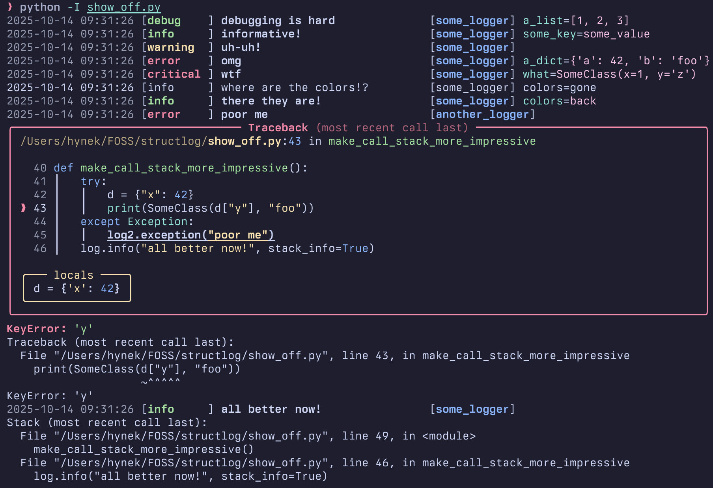

Development
===========

To make development a more pleasurable experience, ``structlog`` comes with the :mod:`structlog.dev` module.

The highlight is :class:`structlog.dev.ConsoleRenderer` that offers nicely aligned and colorful (requires the `colorama module <https://pypi.org/project/colorama/>`_ installed) console output while in development:

To use it, just add it as a renderer to your processor chain.
It will recognize logger names, log levels, time stamps, stack infos, and tracebacks as produced by ``structlog``'s processors and render them in special ways.

``structlog``'s default configuration already uses :class:`~structlog.dev.ConsoleRenderer`, therefore if you want nice colorful output on the console, you don't have to do anything except installing colorama.
If you want to use it along with standard library logging, we suggest the following configuration:

.. code-block:: python

    import structlog

    structlog.configure(
        processors=[
            structlog.stdlib.add_logger_name,
            structlog.stdlib.add_log_level,
            structlog.stdlib.PositionalArgumentsFormatter(),
            structlog.processors.TimeStamper(fmt="%Y-%m-%d %H:%M.%S"),
            structlog.processors.StackInfoRenderer(),
            structlog.processors.format_exc_info,
            structlog.dev.ConsoleRenderer()  # <===
        ],
        context_class=dict,
        logger_factory=structlog.stdlib.LoggerFactory(),
        wrapper_class=structlog.stdlib.BoundLogger,
        cache_logger_on_first_use=True,
    )
