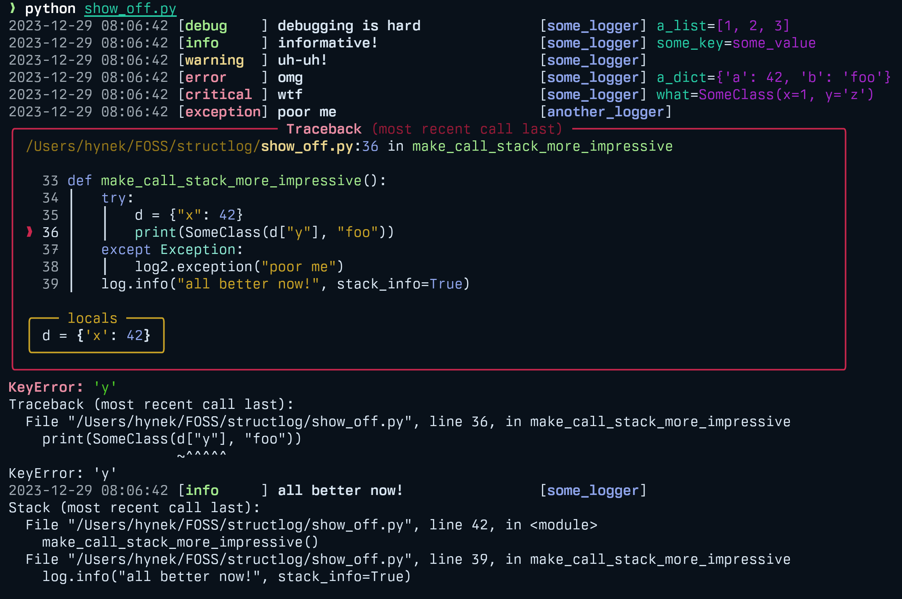

Development
===========

To make development a more pleasurable experience, ``structlog`` comes with the `structlog.dev` module.

The highlight is `structlog.dev.ConsoleRenderer` that offers nicely aligned and colorful (requires the `colorama package <https://pypi.org/project/colorama/>`_ installed) console output.
If the `better-exceptions <https://github.com/Qix-/better-exceptions>`_ package is installed, it will also pretty-print exceptions with helpful contextual data.

You can find the code for the output above `in the repo <https://github.com/hynek/structlog/blob/main/show_off.py>`_.

To use it, just add it as a renderer to your processor chain.
It will recognize logger names, log levels, time stamps, stack infos, and ``exc_info`` as produced by ``structlog``'s processors and render them in special ways.

.. warning::

   For pretty exceptions to work, `format_exc_info` must be **absent** from the processors chain.

``structlog``'s default configuration already uses `ConsoleRenderer`, therefore if you want nice colorful output on the console, you don't have to do anything except installing *colorama* and *better-exceptions*.
If you want to use it along with standard library logging, we suggest the following configuration:

.. code-block:: python

    import structlog

    structlog.configure(
        processors=[
            structlog.stdlib.add_logger_name,
            structlog.stdlib.add_log_level,
            structlog.stdlib.PositionalArgumentsFormatter(),
            structlog.processors.TimeStamper(fmt="%Y-%m-%d %H:%M.%S"),
            structlog.processors.StackInfoRenderer(),
            structlog.dev.ConsoleRenderer()  # <===
        ],
        context_class=dict,
        logger_factory=structlog.stdlib.LoggerFactory(),
        wrapper_class=structlog.stdlib.BoundLogger,
        cache_logger_on_first_use=True,
    )
