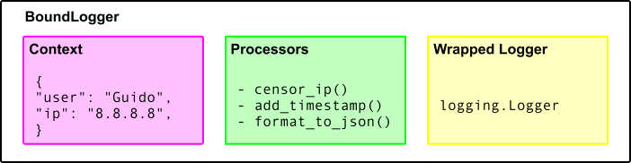

Loggers
=======

Bound Loggers
-------------

The centerpiece of ``structlog`` that you will interact with most is called a *bound logger*.
It is what you get back from `structlog.get_logger()` and call your logging methods on.

It consists of three parts:

#. A *context dictionary* that you can *bind* key/value pairs to.
   This dictionary is *merged* into each log entry that is logged from *this logger specifically*.
   That means that every logger has it own context, but it is possible to have global contexts using :doc:`context variables <contextvars>`.
#. A list of :doc:`processors <processors>` that are called on every log entry.
#. And finally a *logger* that it's wrapping.
   This wrapped logger is reponsible for the *output* of the log entry that has been returned by the last processor.
   This *can* be standard library's `logging.Logger`, but absolutely doesn't have to.
   Bound loggers themselves do *not* do any I/O themselves.

To manipulate the context dictionary, it offers to:

- Recreate itself with (optional) *additional* context data: :func:`~structlog.BoundLogger.bind` and :func:`~structlog.BoundLogger.new`.
- Recreate itself with *less* context data: :func:`~structlog.BoundLogger.unbind`.

In any case, the original bound logger or its context are never mutated.

Finally, if you call *any other* method on :class:`~structlog.BoundLogger`, it will:

#. Make a copy of the context -- now it becomes the *event dictionary*,
#. Add the keyword arguments of the method call to the event dict.
#. Add a new key ``event`` with the value of the first positional argument of the method call to the event dict.
#. Run the processors successively on the event dict.
   Each processor receives the result of its predecessor.
#. Finally, it takes the result of the final processor and calls the method with the same name – that got called on the bound logger – on the wrapped logger\ [1]_.
   For flexibility, the final processor can return either a string\ [2]_ that is passed directly as a positional parameter, or a tuple ``(args, kwargs)`` that are passed as ``wrapped_logger.log_method(*args, **kwargs)``.

.. [1] Since this is slightly magicy, ``structlog`` comes with concrete loggers for the `standard-library` and :doc:`twisted` that offer you explicit APIs for the supported logging methods but behave identically like the generic BoundLogger otherwise.
       Of course, you are free to implement your own bound loggers too.
.. [2] `str`, `bytes`, or `bytearray` to be exact.

Creation
--------

You won't be instantiating bound loggers yourself.
In practice you will configure ``structlog`` as explained in the `next chapter <configuration>` and then just call `structlog.get_logger`.

In some rare cases you may not want to do that.
For that times there is the `structlog.wrap_logger` function that can be used to wrap a logger without any global state (i.e. configuration):

.. _proc:

.. doctest::

   >>> import structlog
   >>> class CustomPrintLogger:
   ...     def msg(self, message):
   ...         print(message)
   >>> def proc(logger, method_name, event_dict):
   ...     print("I got called with", event_dict)
   ...     return repr(event_dict)
   >>> log = structlog.wrap_logger(
   ...     CustomPrintLogger(),
   ...     wrapper_class=structlog.BoundLogger,
   ...     processors=[proc],
   ... )
   >>> log2 = log.bind(x=42)
   >>> log == log2
   False
   >>> log.msg("hello world")
   I got called with {'event': 'hello world'}
   {'event': 'hello world'}
   >>> log2.msg("hello world")
   I got called with {'x': 42, 'event': 'hello world'}
   {'x': 42, 'event': 'hello world'}
   >>> log3 = log2.unbind("x")
   >>> log == log3
   True
   >>> log3.msg("nothing bound anymore", foo="but you can structure the event too")
   I got called with {'foo': 'but you can structure the event too', 'event': 'nothing bound anymore'}
   {'foo': 'but you can structure the event too', 'event': 'nothing bound anymore'}

As you can see, it accepts one mandatory and a few optional arguments:

**logger**
   The one and only positional argument is the logger that you want to wrap and to which the log entries will be proxied.
   If you wish to use a :ref:`configured logger factory <logger-factories>`, set it to `None`.

**processors**
   A list of callables that can :doc:`filter, mutate, and format <processors>` the log entry before it gets passed to the wrapped logger.

   Default is ``[``:class:`~structlog.processors.StackInfoRenderer`, :func:`~structlog.processors.format_exc_info`, :class:`~structlog.processors.TimeStamper`, :class:`~structlog.dev.ConsoleRenderer`\ ``]``.

**context_class**
   The class to save your context in.

   Since all supported Python versions have ordered dictionaries, the default is a plain `dict`.

Additionally, the following arguments are allowed too:

**wrapper_class**
   A class to use instead of :class:`~structlog.BoundLogger` for wrapping.
   This is useful if you want to sub-class BoundLogger and add custom logging methods.
   BoundLogger's bind/new methods are sub-classing-friendly so you won't have to re-implement them.
   Please refer to the :ref:`related example <wrapper_class-example>` for how this may look.

**initial_values**
   The values that new wrapped loggers are automatically constructed with.
   Useful, for example, if you want to have the module name as part of the context.

.. note::

   Free your mind from the preconception that log entries have to be serialized to strings eventually.
   All ``structlog`` cares about is a *dictionary* of *keys* and *values*.
   What happens to it depends on the logger you wrap and your processors alone.

   This gives you the power to log directly to databases, log aggregation servers, web services, and whatnot.
